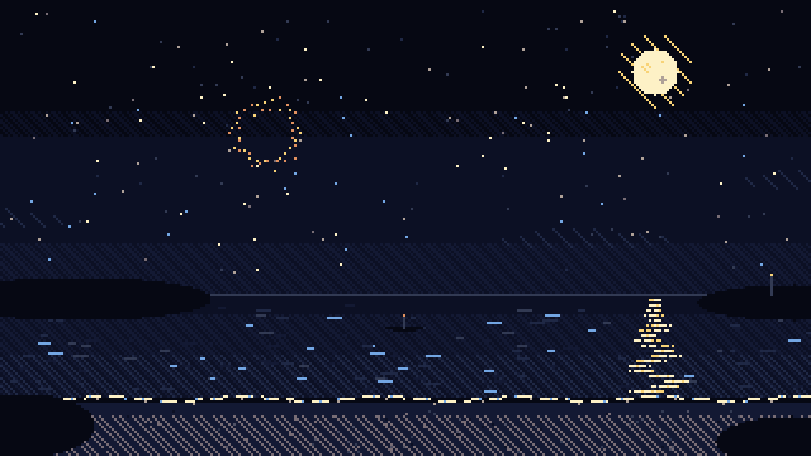
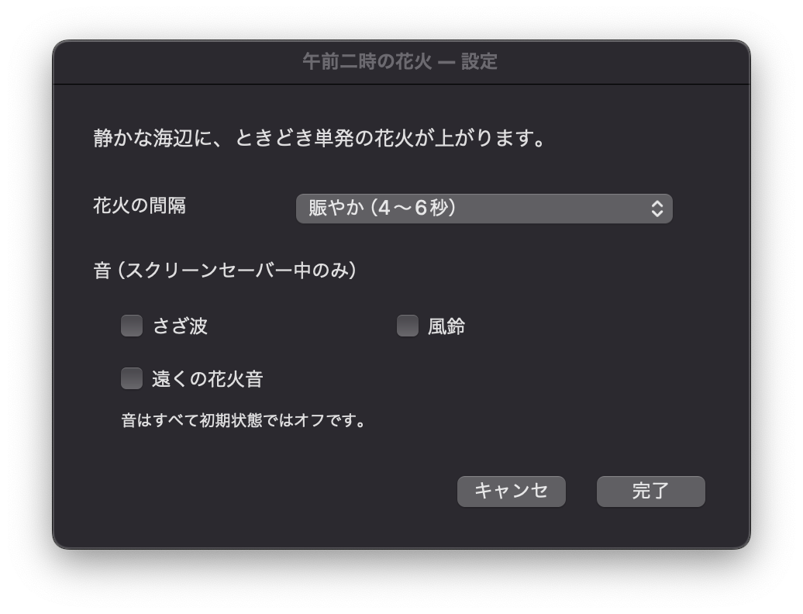

# Midnight Fireworks Screensaver

**English** | [日本語](README.ja.md)

**午前二時の花火 (Fireworks at 2 A.M.)** is a macOS screen saver for quietly watching distant fireworks over a moonlit beach.



## Download

[**Download Midnight Fireworks Screensaver v1.1.1 (ZIP)**](release/Midnight-Fireworks-Screensaver-v1.1.1.zip)

- Requires macOS 11 Big Sur or later
- Supports Apple Silicon and Intel Macs (Universal Binary)
- Appears in macOS as `午前二時の花火`

## Features

- A pixel-art seaside scene with the moon, stars, distant islands, and moonlight reflected on the water
- Seven firework styles: peony, chrysanthemum, willow, ring, strobe, senrin, and palm
- The first firework launches as soon as the screen saver starts
- Fireworks travel straight upward and bloom high in the sky
- No star mine sequences or full-screen flashes
- Three selectable launch frequencies
- Optional wave, wind chime, and distant firework sounds, all disabled by default

## Installation

1. Download and extract the ZIP file above.
2. Double-click `午前二時の花火.saver`.
3. Follow the macOS prompt to install it.
4. Open System Settings → Screen Saver and select `午前二時の花火`.
5. Open Options to adjust the firework frequency and sounds.

### macOS security notice

The downloadable build is ad hoc signed, but it is not signed with an Apple Developer ID or notarized by Apple. macOS may therefore report that it cannot verify the developer when you first open it.

Review the source and build instructions first. Only if you trust the source, try opening the screen saver once and then choose Open Anyway under System Settings → Privacy & Security. See [Apple's guidance](https://support.apple.com/en-gb/102445) for details.

## Options

| Setting | Behavior |
| --- | --- |
| Lively | A firework approximately every 4–6 seconds |
| Quiet | Approximately every 20–45 seconds (default) |
| Very quiet | Approximately every 35–70 seconds |
| Sound | Independently enable waves, wind chimes, and distant fireworks |



## Build from source

Xcode Command Line Tools are required. After cloning the repository, run:

```sh
chmod +x build.sh
./build.sh
```

The screen saver will be created at `dist/午前二時の花火.saver`. The build script produces an arm64/x86_64 Universal Binary and applies a local ad hoc signature.

## Preview and regression test host

The repository includes a small host application that checks rendering through ScreenSaver.framework, all seven firework styles, and the configuration controls.

```sh
mkdir -p build
xcrun clang -fobjc-arc -fmodules \
  -framework AppKit -framework ScreenSaver \
  Tools/PreviewHost.m -o build/PreviewHost

./build/PreviewHost \
  "dist/午前二時の花火.saver" \
  /tmp/midnight-fireworks-preview.png \
  /tmp/midnight-fireworks-settings.png
```

## License

The source code is available under the [MIT License](LICENSE). The bundled audio uses recordings released under CC0; see [AUDIO_CREDITS.md](AUDIO_CREDITS.md) for attribution and source links.
